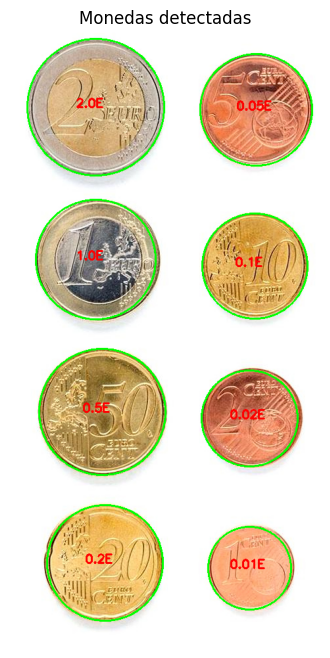
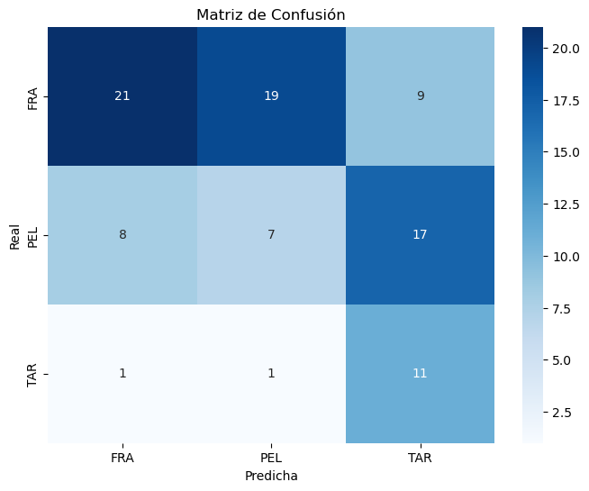

# Práctica 3. Detección y reconocimiento de formas

En esta práctica he implementado dos clasificadores: uno para **monedas** y otro para **microplásticos**.  
Comenzaremos analizando el caso de las monedas.

---

## Problema de las monedas

En este problema debemos detectar las monedas presentes en una imagen proporcionada y calcular el **valor total** del dinero contenido en ella.

```python
# --- Detección de círculos ---
img = cv2.imread('Monedas.jpg')
gris = cv2.cvtColor(img, cv2.COLOR_BGR2GRAY)

# Aumentar contraste
clahe = cv2.createCLAHE(clipLimit=2.0, tileGridSize=(8,8))
gris_contraste = clahe.apply(gris)

# Suavizado
pimg = cv2.GaussianBlur(gris_contraste, (11, 11), 1)
bordes = cv2.Canny(pimg, 70, 150)

# Detección de círculos
circ = cv2.HoughCircles(
    bordes, cv2.HOUGH_GRADIENT, 1, 100,
    param1=100, param2=50, minRadius=50, maxRadius=150
)

if circ is not None:
    circ = np.uint16(np.around(circ))
    print(f"Se detectaron {len(circ[0])} círculos.")
else:
    print("No se detectaron círculos.")
    circ = np.array([[]])
```

Primero cargamos y procesamos la imagen.  
Aplicamos **CLAHE** para aumentar el contraste de forma adaptativa según la intensidad del histograma (esto ayudó especialmente con la moneda de **1 céntimo**, cuyo brillo dificultaba la detección del borde).  
Después, usamos un **filtro gaussiano** para suavizar la imagen, seguido de **Canny** para detectar los bordes.  
Finalmente, utilizamos **HoughCircles** para la detección de los círculos correspondientes a las monedas.

```python
# --- Mostrar imagen y capturar clic de referencia  ---
click_point = []

def click_event(event, x, y, flags, param):
    if event == cv2.EVENT_LBUTTONDOWN:
        click_point.append((x, y))
        print("Clic en:", x, y)
        cv2.destroyAllWindows()

img_rgb = cv2.cvtColor(img, cv2.COLOR_BGR2RGB)
for (x, y, r) in circ[0]:
    cv2.circle(img, (x, y), r, (0, 255, 0), 2)

cv2.imshow("Haz clic sobre la moneda de 1€", img)
cv2.setMouseCallback("Haz clic sobre la moneda de 1€", click_event)
cv2.waitKey(0)
cv2.destroyAllWindows()
```

Capturamos el clic del ratón para seleccionar la **moneda de referencia** (por ejemplo, 1 €).  
A partir de su posición, podemos identificar el círculo correspondiente y calcular su radio.

```python
# --- Buscar círculo seleccionado ---
    selected_circle = None
    for (x, y, r) in circ[0]:
        distancia = np.sqrt((cx - x)**2 + (cy - y)**2)
        if distancia <= r:
            selected_circle = (x, y, r)
            break

    if selected_circle:
        x2e, y2e, r2e = selected_circle
        print(f"Referencia de 1€: centro ({x2e}, {y2e}), radio {r2e}")

        # --- Diccionario de monedas ---
        diccionariodemonedas = {
            2.0: 25.75,
            1.0: 23.25,
            0.50: 24.25,
            0.20: 22.25,
            0.10: 19.75,
            0.05: 21.25,
            0.02: 18.75,
            0.01: 16.26
        }

        total = 0
        img_rgb = cv2.cvtColor(img, cv2.COLOR_BGR2RGB)

        print("\n--- Depuración de identificación de monedas ---")
        for idx, (x, y, r) in enumerate(circ[0]):
            # Relación píxeles a mm
            relacionPixeles = r / r2e
            moneda_identificada = None
            min_diferencia = float('inf')

            print(f"\nCírculo {idx+1}: centro=({x},{y}), radio={r}")
            print(f"Radio relativo a 2€: {relacionPixeles:.3f}")

            for valor, diametro in diccionariodemonedas.items():
                radio_estimado = diametro * (r2e / diccionariodemonedas[1.0])
                diferencia = abs(r - radio_estimado)
                print(f"  Comparando con {valor}€: radio estimado={radio_estimado:.2f}, diferencia={diferencia:.2f}")
                if diferencia < min_diferencia:
                    min_diferencia = diferencia
                    moneda_identificada = valor

            print(f"--> Moneda asignada: {moneda_identificada}€ (diferencia mínima={min_diferencia:.2f})")
            total += moneda_identificada

            # Dibujar círculo y valor
            cv2.circle(img_rgb, (x, y), r, (0, 255, 0), 2)
            cv2.putText(img_rgb, f"{moneda_identificada}E", (x-30, y), 
                        cv2.FONT_HERSHEY_SIMPLEX, 0.6, (255,0,0), 2)

        print(f"\nDinero total: {total}€")

        # Mostrar resultado
        plt.figure(figsize=(10,8))
        plt.axis("off")
        plt.imshow(img_rgb)
        plt.title("Monedas detectadas")
        plt.show()
```

En esta parte, tomando una moneda de referencia (por ejemplo, **1 €**), calculamos el tamaño relativo de las demás monedas en píxeles.  
El algoritmo compara cada círculo detectado con los valores reales de las monedas en milímetros, asignando a cada una el valor más probable.  
Finalmente, calcula correctamente el **dinero total presente en la imagen** que es de 3.88€.



---

## Problema de los microplásticos

En este segundo problema se aborda la detección y segmentación de **tres tipos de microplásticos**:  
- Fragmentos desprendidos (FRA)  
- Pellets (PEL)  
- Alquitrán (TAR)

Se nos proporcionan tres imágenes de entrenamiento (una por tipo) y una imagen con todos los tipos mezclados, que utilizaremos para poner a prueba el clasificador.

```python
# Función proporcionada por el usuario para preprocesar y segmentar
def preprocess_and_segment(img):
    # Aplicar un filtro Gaussian Blur
    img_blur = cv2.GaussianBlur(img, (5,5), 0)
    
    # Aplicar umbralización adaptativa usando Otsu
    _, thresh = cv2.threshold(img_blur, 0, 255, cv2.THRESH_BINARY_INV + cv2.THRESH_OTSU)
    
    # Contornos
    contours, _ = cv2.findContours(thresh, cv2.RETR_EXTERNAL, cv2.CHAIN_APPROX_SIMPLE)
    
    # Filtrar contornos por área eliminando asi el ruido
    contours = [c for c in contours if cv2.contourArea(c) > 100]
    
    return contours
```

Primero definimos la función para extraer los **contornos** de las partículas.  
Aplicamos un **filtro gaussiano** para suavizar, luego **umbralizamos con Otsu** para segmentar mejor, y finalmente **filtramos por área** para eliminar ruido y partículas irrelevantes.

```python
# Función para extraer características de una imagen, incluyendo 
def extract_features(img):
    gray = cv2.cvtColor(img, cv2.COLOR_BGR2GRAY)  # Convertir a grises para segmentación
    contours = preprocess_and_segment(gray)  # Usar la nueva función para obtener contornos
    
    if contours:  # Si hay contornos
        cnt = max(contours, key=cv2.contourArea)  # Contorno más grande
        mask = np.zeros(gray.shape, np.uint8)  # Crear máscara para el contorno
        cv2.drawContours(mask, [cnt], -1, 255, -1)  # Dibujar el contorno en la máscara
        
        # Características geométricas
        area = cv2.contourArea(cnt)  # Área
        perimeter = cv2.arcLength(cnt, True)  # Perímetro
        compactness = (perimeter ** 2) / area if area > 0 else 0  # Compacidad
        
        x, y, w, h = cv2.boundingRect(cnt)  # Rectángulo contenedor
        bounding_area = w * h
        area_ratio = area / bounding_area if bounding_area > 0 else 0  # Relación área/partícula con contenedor
        aspect_ratio = w / h if h > 0 else 0  # Relación ancho/alto
        
        if len(cnt) >= 5:  # Para ajustar elipse
            ellipse = cv2.fitEllipse(cnt)
            major_axis = max(ellipse[1])  # Eje mayor
            minor_axis = min(ellipse[1])  # Eje menor
            ellipse_ratio = minor_axis / major_axis if major_axis > 0 else 0  # Relación ejes
        else:
            ellipse_ratio = 0
        
        M = cv2.moments(cnt)  # Centroide
        if M["m00"] != 0:
            cx = M["m10"] / M["m00"]
            cy = M["m01"] / M["m00"]
            distances = [np.sqrt((point[0][0] - cx)**2 + (point[0][1] - cy)**2) for point in cnt]
            if distances:
                max_dist = max(distances)
                min_dist = min(distances)
                dist_ratio = min_dist / max_dist if max_dist > 0 else 0  # Relación distancias
            else:
                dist_ratio = 0
        else:
            dist_ratio = 0
        
        # Características de color: Calcular medias de R, G, B en la región del contorno
        mean_colors = cv2.mean(img, mask=mask)  # cv2.mean devuelve [B, G, R, ...], pero usaremos B, G, R
        mean_b = mean_colors[0]  # Media de Blue
        mean_g = mean_colors[1]  # Media de Green
        mean_r = mean_colors[2]  # Media de Red
        
       
        return [area, perimeter, compactness, area_ratio, aspect_ratio, ellipse_ratio, dist_ratio, mean_r, mean_g, mean_b]
    return None  # Sin contornos válidos
```

En esta función extraemos las **características** de cada partícula. Usamos:  

- Área: Superficie total ocupada por el contorno detectado.  
- Perímetro: Longitud del borde del contorno.  
- Compacidad: Medida de cuán compacta o irregular es la forma.  
- Relación área/rectángulo contenedor: Proporción entre el área del contorno y el área del rectángulo que lo contiene.  
- Relación ancho/alto: Proporción entre el ancho y la altura del rectángulo que encierra la forma.  
- Relación de ejes de la elipse: Comparación entre el eje menor y el eje mayor de la elipse ajustada al contorno.  
- Relación de distancias al centroide: Relación entre la distancia mínima y máxima de los puntos del contorno al centroide.  
- Media del canal rojo: Promedio de la intensidad del color rojo dentro del contorno.  
- Media del canal verde: Promedio de la intensidad del color verde dentro del contorno.  
- Media del canal azul: Promedio de la intensidad del color azul dentro del contorno.  

```python
# Función de clasificación heurística con normalización
def classify(features_new):
    features_list = [features_FRA, features_PEL, features_TAR]  # Lista de vectores
    labels = ['FRA', 'PEL', 'TAR']  # Etiquetas correspondientes
    
    if features_new is None:
        return 'UNKNOWN'  # Caso de error
    
    # Filtrar vectores válidos y normalizar
    valid_features = [feat for feat in features_list if feat is not None]  # Solo vectores válidos
    if len(valid_features) == 0:
        print("Error: No hay características válidas en el entrenamiento.")
        return 'UNKNOWN'
    
    # Normalización: Calcular media y std de los vectores de entrenamiento válidos
    valid_features_array = np.array(valid_features)  # Convertir a array
    means = np.mean(valid_features_array, axis=0)  # Media por característica
    stds = np.std(valid_features_array, axis=0)  # Desviación estándar por característica
    stds[stds == 0] = 1  # Evitar división por cero
    
    # Normalizar features_new
    features_new_normalized = (np.array(features_new) - means) / stds  # Estandarizar
    
    distances = []  # Calcular distancias euclidianas normalizadas
    for feat in features_list:
        if feat is not None:
            feat_normalized = (np.array(feat) - means) / stds  # Normalizar cada vector de entrenamiento
            distance = np.linalg.norm(features_new_normalized - feat_normalized)  # Distancia euclidiana
            distances.append(distance)
        else:
            distances.append(float('inf'))  # Distancia infinita para vectores inválidos
    
    if all(dist == float('inf') for dist in distances):  # Si todas son infinitas
        print("Error: Todas las distancias son infinitas.")
        return 'UNKNOWN'
    
    min_index = np.argmin(distances)  # Índice de la mínima distancia
    return labels[min_index]  # Devolver la etiqueta
```

Finalmente, calculamos las **distancias euclidianas** entre los vectores de las partículas a detectar y los vectores de referencia obtenidos de las imágenes de entrenamiento.  
El vector con menor distancia determina el tipo de microplástico detectado.

**Resultados obtenidos:**  
- Accuracy: 0.4149  
- Precision: 0.4943  
- Recall: 0.4149  
- F1 Score: 0.4188  


